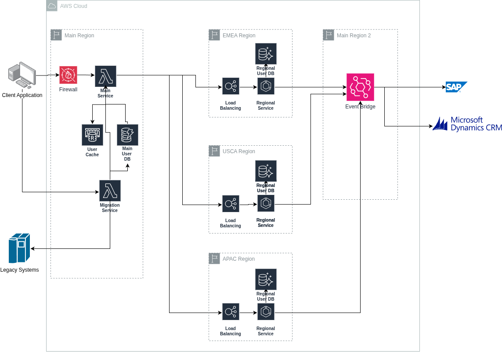

# UUS = Universal User Service

This solution will be the center of User unification proposal.

It is presented using AWS components, but I tried to keep things as conceptual as possible.

Decisions were taken with available amount of information and can be revisited if needed.

## Goals

The main objectives are:
- centralized view of company's users;
- compliance with local regulations;
- unique point of authority regarding Users;

For the instructions we already have a pilot solution.

We just need to make it scallable and orchestrate data storage.

We'll achieve it for creating a orchestration layer and router strategy on top of it.

## Data Organization

The user has one pseudonymized id: UUID (Universal User Id).
This ID can be generated by any means intended, just needs to be unique.
This ID is still considered "personal data" but this way we lowers the risk trafegating and storing the data.

This id points to minimal user information.  This information is just to desambiguate the person (birth country + birth id for example).

### User Home

The most important information is the user home.

Based on that the main services directs to a regional service where the data is stored.

We can have several user databases across the world, grouped in regions according to regulations.

Possible arrangements are:
- USCA: United States & Canada;
- EMEA: Europe, Middle East, Africa;
- APAC: Asian, Pacific;

and so it goes

*The groupings may change but note that we don't need a database per country*

Any site wanting to know user details queries a central service passing the UUID.
This service routes the request to regional services according to user home.

## Service Organization

### Main Service

The main service is the great addition to existent solution.

It works as a facade to avoid client system dealing with specific regions clauses

It receives request from client systems and route to specific local system.

A cache system here helps to alleviate load over regional services without configuring stable data authority.

### Regional Services

This system is the worker that persist user data.

That's where the pilot system cames to play.

We just make it accept an external user id (the UUID generated in main service) and keep the persistence logic intact.

### Migration Service

We are considering that a big amount of user data lies in legacy system today.

Any system that needs to query customer information without the UUID call this sanitize service.

The request need to receive sufficient desambiguation information for the service to be able to identify if the user record is already migrated (it exists in main database).  If it exists, returns the UUID (only the request, the caller should call main service next time).

If not exists, it queries legacy systems for the data, create a UUID for the user and triggers the corresponding regional service to write it.

*This is the moment where a user is created in unified database*

### Event Bus

To avoid having point-to-point integrations we may create a corporate event bus for "User" domain events

System interested in these events are:
- integrations that push/update the data in legacy systems;
- main service (to invalidate cache data if needed);
- audit systems;

## Security

Security points considered in this solution:

### Network structure

All Regional services lies in private subnets without other route but the main service.

Main service becomes an audit point for all operations but it can became noisy.

A toggle feature can be useful here (all operations, only write operations, only failed operations, ...)

### Data Storage
The data stored in main region will be encrypted at rest for main information.

Cache service will have route only for main service.

### Authentication

Regional Services can work as Federated Entities for a capable service like Cognito, Firebase Authentication

Main Service will be behind a firewall that only accepts requests from whitelisted IPs.

## Challenges

Here are some challenges not addressed by the current solution.

For some of them more information are needed.

Others are decision points to be adapted according to company needs.

### User profile sanitization

We are considering the user profile has a couple of mandatory attributes.

These will be present in each profile across the globe.

Besides that, a set of optional attributes should be supported.

They will be mapped as flex fields in user domain and kept in a dictionary.

Legacy service is one point where sanitization can occur.

This service may become as complex as needed to cover legacy migration.

*For "legacy" here we'll consider any pre-unification user services.*

### User migration strategy

Migration service was conceived in a gradual migration approach.

If can be rewrited using a batch migration approach.